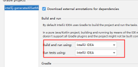

一个idea插件。

# 功能清单

- 添加intention，生成entity的`get all setter`或`get all getter`。
- 自动生成转换
  
- MongoDB根据entity一键生成增删改查，大大提高crud boy的开发效率。
- 根据接口定义，生成接口信息推送到postman，提高调试效率。

# 自定义开发指引 

- 克隆项目用idea打开，设置encoding为utf-8，否则控制台无法输出中文。
- gradle build 要设置成idea 
- 项目中设置idea plugin sdk 指向
